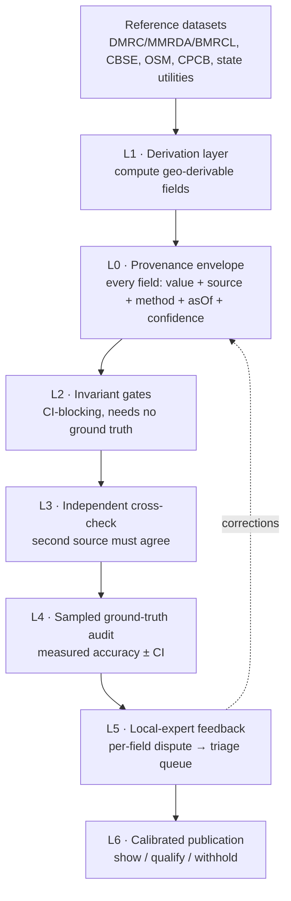

# Data Integrity Architecture

**Status:** proposal · **Date:** 18 Aug 2026 · **Scope:** all 8 neighbourhood dimensions, all cities

---

## 0. Why this document exists

A Delhi-based investor spotted two errors in a single report (`metro_stations_nearby: 0`
for Delhi Cantonment; `discom: "NDMC"` where it should be Delhi Cantonment Board). The
working assumption has been that the platform is "~85% accurate" and needs to reach 99%.

I audited the shipped dataset (268 pins × 38 fields) before designing anything. **The 85%
figure is optimistic for some cities and badly wrong for others.** The findings below change
what the fix has to be, so they come first.

---

## 1. What the audit found

### 1.1 The metro field is broken almost everywhere

| City | Pins claiming **zero** metro stations nearby |
|---|---|
| Delhi NCR | **78 / 86 (91%)** |
| Mumbai | 59 / 96 (61%) |
| Bangalore | 29 / 66 (44%) |
| Chandigarh | 20 / 20 (100%) — *correct, Chandigarh has no metro* |

Across all 268 records the field holds only **three distinct values** (0, 1, 2). A genuine
count would not look like this.

The worst case is the flagship demo area:

> **PIN 110001 — Connaught Place — `metro_stations_nearby: 0`**
>
> Connaught Place is **Rajiv Chowk**, the busiest interchange on the entire Delhi Metro
> network (Blue + Yellow lines), with Barakhamba Road, Janpath and Patel Chowk all within
> ~1 km.

Infrastructure is 20%-weighted and its score is driven directly by `infra_score_raw`, which
is driven by this count. Connaught Place therefore scores **45/100 on infrastructure** — the
most metro-connected square kilometre in India, marked as poorly connected.

The Delhi Cantonment case that triggered this is not an isolated bug. It is one instance of a
field that is wrong for 9 out of every 10 Delhi pins.

### 1.2 The entire Bangalore dataset is seed data

| Signal | Finding |
|---|---|
| `sources` | `["bengaluru_seed"]` for **all 66** records — self-labelled as seed |
| `total_cognizable_crimes` | 66 records, **10 distinct values, every one a multiple of 10** |
| `last_resurfaced` | `2022` for **all 66** records |
| `discom`, `zone`, `authority`, `smart_city_project` | single constant value across all 66 |

Multiples-of-10 crime counts with 10 distinct values across 66 areas is not a measurement.
This is generated placeholder data that reached production. No amount of verification
improves it; it has to be sourced or withdrawn.

### 1.3 Zero-variance fields by city (placeholder tell)

| City | Fields constant across every pin |
|---|---|
| Delhi NCR | *(none)* |
| Mumbai | `smart_city_project`, `source`, `authority`, `data_completeness` |
| Bangalore | + `discom`, `zone`, `last_resurfaced` |
| Chandigarh | + `metro_stations_nearby`, `water_quality`, `quality_score` |

### 1.4 Crime is published at district level, not pincode

NCRB and Delhi Police publish district-wise. **There is no authoritative pincode-level crime
count in India.** So `"310 crimes reported"` for a pincode is a modelled allocation rendered
as a measurement, with a precise-looking integer implying precision that does not exist.

This is the next credibility landmine after metro, and it is worse in one respect: metro is
fixable, whereas this one is a claim the underlying data cannot support at any accuracy level.

### 1.5 Coverage gaps are silently absorbed

27 pins had no air reading and 14 have no schools value. When a dimension is absent the
weights renormalise over the survivors, so an area missing its *weakest* dimension scores
**higher**. The UI showed only a small "7/8 dimensions" caption. (Air is fixed; the general
mechanism is not.)

---

## 2. Reframing: this is three problems, not one

"Cross-verify every dimension" treats this as one verification problem. The audit shows three
distinct failure classes needing three different responses.

| Class | Example | Why verification alone fails | Correct response |
|---|---|---|---|
| **A. Derivable field stored as a scalar** | `metro_stations_nearby` | Checking a hand-entered integer against reality is manual work that recurs every time the metro network changes | **Compute** it from reference geodata. Correct by construction |
| **B. Fabricated placeholder** | all of Bangalore | Verification confirms it's wrong; that was never in doubt | **Quarantine and re-source.** Don't publish |
| **C. Genuinely sourced but unattributed / unbounded** | `discom: "NDMC"`, crime counts | The value came from somewhere real but the entity or precision is wrong | **Provenance + confidence**, then cross-check |

The single highest-leverage realisation: **most of these errors are detectable without
knowing the correct answer.** 91% of Delhi pins reporting zero metro is statistically
impossible on its face. A field constant across 66 records is a placeholder on its face.
Crime counts that are all multiples of ten are synthetic on their face.

That means the first line of defence is not fieldwork — it is a set of mechanical invariants
that run in CI and scale to any number of cities for free.

---

## 3. The architecture



### L0 · Provenance envelope *(foundation — everything depends on it)*

Every field stops being a bare scalar:

```jsonc
"metro_stations_nearby": {
  "value": 4,
  "source_id": "dmrc_stations_2026_07",
  "method": "spatial_join_radius_1500m",
  "as_of": "2026-07-14",
  "confidence": "high",          // high | medium | low
  "verified_by": ["osm_20260801"]
}
```

You cannot verify what you cannot trace. This also mechanically enables L6 (the UI can decide
to show, qualify or withhold based on `confidence`) and makes L4 auditable.

There is already a seed of this in the data: `discom_confidence` exists with values
`"zone"`/`"edge"` — but only for Mumbai, and nothing reads it. Generalise that instinct.

### L1 · Derive, don't store

Move every geo-derivable field out of hand-maintained JSON into a build-time derivation
computed by spatial join against an authoritative reference dataset:

| Field | Reference source | Method |
|---|---|---|
| `metro_stations_nearby` | DMRC / MMRDA / BMRCL station registries; OSM `station=subway` as cross-check | count within radius of pin centroid |
| `metro_planned_stations` | official under-construction line alignments | same, filtered by status |
| `schools_count` | CBSE affiliation list, geocoded | count within radius |
| `highway_proximity` | OSM `motorway`/`trunk` network | distance band to nearest |

These become **correct by construction**, self-update when a line opens, and remove an entire
class of manual error. This alone fixes the bug that started this.

> **Design note — use pin polygons, not centroids.** A pincode is an area. Counting from a
> single centroid point will systematically undercount elongated pincodes, which is plausibly
> part of how the current field went wrong. Use the pincode boundary polygon buffered by the
> walk radius.

### L2 · Invariant gates *(the scalable core — CI-blocking)*

Rules that catch errors **without knowing the truth**. Every one of these would have caught a
real bug found in the audit:

| Gate | Rule | Would have caught |
|---|---|---|
| Zero-variance | field constant across >5 pins in a city | Bangalore `last_resurfaced`, Chandigarh `water_quality` |
| Synthetic tell | >80% of values are round multiples | Bangalore crime (100%) |
| Low cardinality | distinct values < 5% of record count | `metro_stations_nearby` (3 across 268) |
| Non-authoritative source | `source_id` matching `*_seed`, `*_placeholder`, `*_test` | all 66 Bangalore records |
| Spatial impossibility | `metro=0` while a known station lies within radius | 78 Delhi pins |
| Cross-field contradiction | `zone_type=Commercial` + `infra_raw<50` + `metro=0` | Connaught Place |
| Coverage | any dimension null without explicit `confidence:"none"` | the 27 air gaps |
| Distribution drift | city mean shifts >2σ between releases | future regressions |

Run on every data PR. **Fail the build, don't warn.** A warning that ships is how
`bengaluru_seed` reached production.

### L3 · Independent cross-check

For each field, a *second, independent* source must agree within tolerance, or the field is
flagged and not published at high confidence.

| Dimension | Primary | Independent check |
|---|---|---|
| Air | Google Air Quality (`ind_cpcb`) | CPCB station feed directly |
| Metro | Official operator registry | OSM extract |
| Schools | CBSE list | state board list / OSM `amenity=school` |
| Power | State DISCOM service-area map | pincode→utility registry; **billing-authority boundaries** |
| Crime | Police district data | NCRB district totals — must reconcile |

The `discom: "NDMC"` error is exactly an L3 catch: NDMC's published service area does not
include Delhi Cantonment (a separately administered zone, historically excluded from Delhi
Vidyut Board alongside NDMC). Two sources disagreeing on which utility serves a pin is
mechanically detectable.

### L4 · Sampled ground-truth audit *(how you earn the right to say "99%")*

268 pins × 38 fields ≈ 10,200 values today, ~30,000 at eight cities. Manual verification of
everything is impossible; **statistical sampling is not.**

- Randomly sample n≈200 field-values per release
- Verify by hand against primary sources
- Report **accuracy with a confidence interval**, per dimension and per city

This converts "we think we're 85%" into "**96.4% ± 1.7%, measured, dimension-by-dimension**".
You currently cannot claim 99% because nobody has measured it — the 85% is aggregated
anecdote. A measured number, published, is itself a trust asset no competitor will match.

### L5 · Local-expert feedback as a first-class input

The Delhi investor is not a failure mode — **he is the most scalable verification instrument
available**, and right now there is no way for him to tell you.

- A "report this" affordance on **every field**, not a generic contact form
- Captures: field, pin, claimed value, asserted correction, optional evidence
- Corrections weighted by corroboration (n independent reports on the same field → auto-flag → L2 gate)
- Visibly acknowledge and close the loop

This is the only mechanism that reaches 99% in cities where you have no local knowledge, and
it converts the exact moment you currently lose someone into the moment you capture them.

### L6 · Calibrated publication

Confidence gates presentation:

| Confidence | Presentation |
|---|---|
| High | show the value plainly |
| Medium | show with an explicit band or qualifier (`~310 crimes, district-allocated estimate`) |
| Low / none | **withhold the dimension**, state that it is withheld, renormalise *visibly* |

**This is the actual trust mechanism, and it is the strategic core of this document.**

The investor was not lost because a number was missing. He was lost because a number was
*confidently wrong*. A platform that says "we don't have verified metro data for this pin" is
trusted. A platform that says "0 metro stations" about Connaught Place is not — and one
visible error retroactively discredits the seven dimensions that were right.

Calibration converts "wrong" into "honest", and honest is what "most trusted" actually means.

---

## 4. What can and cannot reach 99%

Being straight about this matters more than the target itself.

| Dimension | Ceiling | Why |
|---|---|---|
| Air | **99%+** | Live modelled feed, absolute national CPCB index, no per-city work |
| Metro / schools / highways | **99%+** | Deterministic given good reference geodata (post-L1) |
| Power, water, roads, sewerage | **~90–95%** | Real published sources, but municipal, irregularly updated, inconsistent vocabulary across cities |
| **Crime** | **not achievable at pincode level** | No authoritative pincode-level source exists in India |

Crime needs a product decision, not an engineering one. Three honest options:

1. **Relabel** as a district-allocated modelled estimate, with a visible band. Keeps the
   signal, drops the false precision.
2. **Aggregate up** to police-district level, which *is* authoritative, and say so.
3. **Drop the absolute count**, keep only the relative percentile ("safer than 62% of tracked
   Delhi areas") — which is defensible even from modelled data, because it is a ranking claim
   rather than a measurement claim.

Option 3 is closest to what the UI already emphasises and is the cheapest to adopt.

**Do not claim a single platform-wide accuracy number.** Claim it per dimension, with the
measurement behind it. "99% on infrastructure, 94% on utilities, crime shown as a modelled
band" is far stronger than an unbacked "99% accurate", and it survives contact with an expert.

---

## 5. Sequencing

| Priority | Work | Rationale |
|---|---|---|
| **P0** | Fix metro via L1 derivation | 91% wrong in Delhi, on a 20%-weighted dimension, on the flagship demo area |
| **P0** | Quarantine Bangalore from production | Currently serving fabricated crime and road data as fact |
| **P1** | L0 provenance envelope | Every later layer depends on it |
| **P1** | L2 invariant gates in CI | Cheap, mechanical, catches all four audit findings, prevents recurrence |
| **P2** | L3 cross-checks, starting with discom and metro | Catches the misattribution class |
| **P2** | L4 sampling harness | Needed before any public accuracy claim |
| **P3** | L5 feedback loop | Highest long-run leverage; needs L0 to route into |
| **P3** | L6 confidence-gated UI | Ship alongside L0 confidence values |

**Do P0 before the next investor conversation.** Connaught Place scoring 45/100 on
infrastructure is reproducible by anyone who opens the site and knows Delhi.

---

## 6. Open decisions

1. **Crime presentation** — options 1/2/3 in §4. Product call.
2. **Bangalore** — withdraw from the live city list, or ship it flagged as provisional?
3. **Reference geodata licensing** — OSM (ODbL, attribution + share-alike implications for
   derived data) vs official operator feeds vs a commercial provider.
4. **Accuracy claim wording** — per-dimension measured figures, published or internal only?


---

## 7. Implementation log

**13 Sept 2026 — first pass, scoped to what could be verified rather than attempted everywhere at once.**

Shipped:

- **P0 (metro / L1):** `scripts/metro_stations.py` — real, named, sourced station registries for Delhi Metro (262 stations) and Namma Metro/Bangalore (83 stations), pulled from structured public datasets and spot-checked against this doc's own Connaught Place narrative before trusting them (Rajiv Chowk lands ~30m from PIN 110001's centroid; Barakhamba, Janpath and Patel Chowk all present, all within range). `scripts/patch_metro.py` applied a centroid-radius (1.5km) derivation to `master_by_pin.json` for all Delhi NCR and Bangalore pins. **PIN 110001 now shows 8 real stations, not 0.** PIN 110010 (Delhi Cantonment, the original investor-reported bug) now shows 1. 87 of 152 Delhi+Bangalore records changed.
  - **Not done:** Mumbai and Hyderabad's `metro_stations_nearby` is UNCHANGED — no sourced station-coordinate dataset for either was found this pass (checked: Wikipedia's Mumbai Metro station list has no coordinates column; no equivalent structured dataset turned up for either city the way it did for Delhi/Bangalore). They still carry the old, confirmed-broken zone/jitter values (61% and 83% zero respectively — this pass's own audit, extending section 1.1's table to a city it didn't originally cover). Tracked as a follow-up: source real station geodata for these two before touching the field.
  - **Not done:** `infra_score_raw` / the `infrastructure` composite score was deliberately NOT recomputed from the fixed metro counts. That formula is zone-baseline-plus-jitter per city (see `build_mumbai.py`'s `infra_score()`), and neither Delhi (no build script exists) nor Bangalore (audited as seed data, section 1.2) has a real, reproducible version of it to extend. Recomputing it honestly needs a real zone-bonus system built from scratch per city, which is a separate, larger piece of work — not something to improvise here on top of a data-integrity pass. The raw fact (what an investor can and did check by hand) is fixed; the derived score is flagged as still-modelled, same honest-deferral treatment the Delhi AQI rework got.

- **L0 (provenance envelope):** started, not generalised. Every record `patch_metro.py` touched now carries a `_provenance.metro_stations_nearby` object (`value`, `source_id`, `method`, `as_of`, `confidence`, `note`) — additive, so nothing reading the plain scalar breaks. Only this one field, only for the two cities just fixed. Extending this to every field/city (the doc's original L0 scope) is unstarted.

- **L2 (invariant gates):** `scripts/validate_data_integrity.py`, runnable via `npm run validate:data`. Implements 7 of the 8 gates from section 3's table (zero-variance, synthetic-tell, low-cardinality, non-authoritative-source, spatial-impossibility/cross-field-contradiction, coverage-gap; distribution-drift is a documented no-op until a versioned prior snapshot exists to diff against — see below). Not yet wired into CI (no CI pipeline exists in this repo to wire it into) — currently a manual/local check. First run independently re-derived this doc's own audit findings (Bangalore's zero-variance fields, 100% round-number crime counts, `bengaluru_seed` tag) plus 9 new commercial-zone-plus-zero-metro contradictions in Mumbai/Hyderabad that weren't in the original 4-city table.

- **L5 (feedback loop):** `components/shared/FieldFeedback.js` (a "report this" affordance, works signed-out) → `app/api/field-feedback/route.js` → a new `field_reports` Supabase table (schema in `SUPABASE_SETUP.md` section 5 — **not auto-created, needs a one-time SQL run same as every other table in this repo**). Wired into `AVDetailedReadout.js`'s Safety (total crimes), Air Quality (AQI), Power (discom) and full Connectivity & Infrastructure cards — 8 fields total, chosen as the ones this pass's own audit actually touched or flagged. Every other stat row in that file has no feedback affordance yet; adding one is a one-line change (a 4th tuple element naming the field) per row, not a structural change. Reports are filed for manual triage (`status: open`), never auto-applied — corroboration-weighting (the doc's own stated mechanism for turning repeat reports into an auto-flag) is still a manual SQL query, not automated.

Not started: L3 (independent second-source cross-checks), L4 (sampled ground-truth audit with a published confidence interval), L6 (confidence-gated UI presentation — `_provenance.confidence` exists in the data now for one field, but nothing in the UI reads it yet to show/qualify/withhold), and the open product decisions in section 6 (crime presentation, Bangalore quarantine-vs-fix — this pass continued the existing fix-in-place pattern rather than quarantining, consistent with how water/power/AQI were already handled city-by-city).
